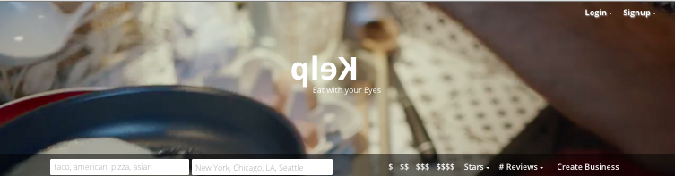
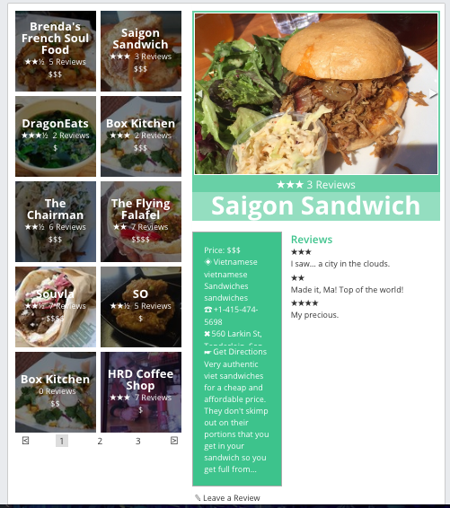
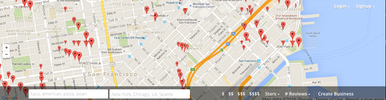

# Kelp

[Kelp live][heroku]

[heroku]: http://www.kelp.pw

Kelp is a full-stack web application inspired by Yelp.  It utilizes React, vanilla JS, jQuery, Ruby on Rails, Sass, and PostgreSQL.

## Features & Implementation

### Single-Page App

Kelp is truly a single-page; all content is delivered on one static page leveraging AJAX. A good example of this is the login component, which abstracts sensitive information using BCrypt and a common Rails Auth Pattern.

```ruby
class Api::SessionsController < ApplicationController
    def get_user
      if current_user
        render :current_user
      else
        render json: errors.full_messages
      end
    end
 end
  ```

### AJAX
To create a seamless UX, AJAX requests are constantly being fired by the Flux cycle. Rails API views is created using JSON Builder. AJAX requests are made via jQuery .ajax method.

### jQuery
Often used for DOM manipulation such as triggering login dropdown, displaying error message, and input box focus when requiring login. Also used for document ready and ajax requests.

### UI
Kelp is an exercise and attempt to weave Yelp's content with Instagram's photo focused social network, since the two passions are often intertwined. The splash page video emphasizes the focus on visuals and playful feel of the website.




### User/Business/Review Database and Relations

  There are three main tables: users, businesses, and reviews. When Reviews are created, it is given the `currentUser_id` and the `business_id`. When either the user or the business is destroyed, the review is destroyed accordingly.

  Businesses are rendered in two different components: the `IndexItem` components, which show the title, review average, and review count, and the `BusinessDetail` components, which are show images and more detailed information.  The `BusinessIndex` renders all of the `IndexItem`s as subcomponents, as well as one `BusinessDetail` component, which renders based on the `props.params.businessId` passed by React's `hashHistory`.



### Businesses

Businesses live in the business table, with appropriate columns to contain all attributes.

Two of the attributes are generated dynamically using Rails' ActiveRecords. Average Reviews and Review Counts are calculated on the Model cycle in the backend API request cycle and served to the frontend.

ActiveRecords code in business.rb Model:

```ruby
def average_rating
  reviews.average(:rating)
end

def review_count
  reviews.count
end
```

`BusinessIndex` component renders a list of `IndexItem`s as subcomponents, along with one `BusinessDetail`, kept track of by hashHistory params.

`IndexItem` is limited to 50 businesses by the API due to the large number of restaurants that could show at one time. `BusinessIndex` uses pagination to only show 10 businesses at any one time. This is achieved by slicing the array of businesses into 10 elements chunks.

`BusinessIndex` render method:

```javascript
{
  businessKeys.slice(showIdx*10, showIdx*10+10).map( key => {
    return (<IndexItem
      business={businesses[key]}
      key={key} />);
  })
}
```

### Filtering

##Map
Businesses are bound by the parameters of the map at all times. Only businesses within this bounds will show. The map bounds are calculated in the `business_map.jsx` and passed onto the `businessesController` which checks the bounds in the `businessModel`, where only businesses within the bounds are served.

Business Model In-Bound Method
```ruby
def self.in_bounds(bounds)
  self.where("lat < ?", bounds[:northEast][:lat])
      .where("lat > ?", bounds[:southWest][:lat])
      .where("lng > ?", bounds[:southWest][:lng])
      .where("lng < ?", bounds[:northEast][:lng])
end
```

##Average Price
Using the `filterParams` API request, `average_price` is sent as an integer in range of 1-4. In the `businessesController`, an ActiveRecords method is run to calculate the average price and serve all the businesses meeting the criteria.

```ruby
if(params[:prices])
  businesses = businesses.where("price <= ? AND price >= ?",
              params[:prices].max.to_i, params[:prices].min.to_i)
end
```

##Average Review
Similar to the Average Price with addition of joining businesses with the reviews table. API request is made to BusinessesController which runs the following code:

```ruby
if(params[:review])
  businesses = businesses.joins(:reviews).group("businesses.id")
    .having("avg(rating) >= ?", params[:review].to_i)
end
```

In the frontend, integer range 4-2 is converted to stars.

```javascript
const reviewRatings = [4, 3, 2].map((rating) => {
  const selected = rating === that.props.filterParams.review;
  return <MenuItem key={rating} active={selected}
    eventKey={rating}>{"★".repeat(rating)}+</MenuItem>;
});
```

### Number of Reviews
Similar to the Average Review request.

```ruby
if(params[:reviewCount])
  businesses = businesses.joins(:reviews).group("businesses.id")
    .having("count(businesses.id) >= ?", params[:reviewCount].to_i)
```

### Search Bar
Each time onInput, the Flux cycle fires off an AJAX request to the controller. Businesses are filtered using the `where` ActiveRecords method and `LIKE` SQL parameter.

```ruby
if(params[:category])
  businesses = businesses.where(
  "lower(category) LIKE ? OR lower(name) LIKE ?",
  "%#{params[:category].downcase}%", "%#{params[:category].downcase}%")
end
```

### Location Search
Location search is implemented using the Google Places API. Request submits an address and response gives back a lat/lng and allows the implemented map to refocus on that location.



### Seeding
Yelp RESTful API was used to pull data and create restaurants in select cities, with fake reviews.

## Future Directions for the Project

In addition to the features already implemented, I plan to continue work on this project.  The next steps for Kelp are outlined below.

### Search

Refactoring search using Fuse.js library to create a fuzzy search instead of current ridged `LIKE` SQL search.

### Tagging

Each businesses and reviews should have multiple descriptive tags.

### Likes

Users should be able to bookmark and share businesses they like.
